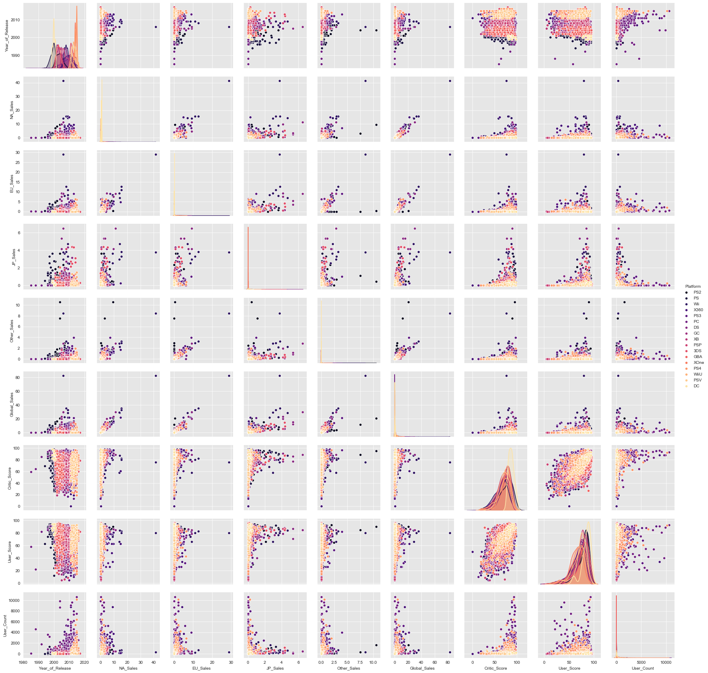
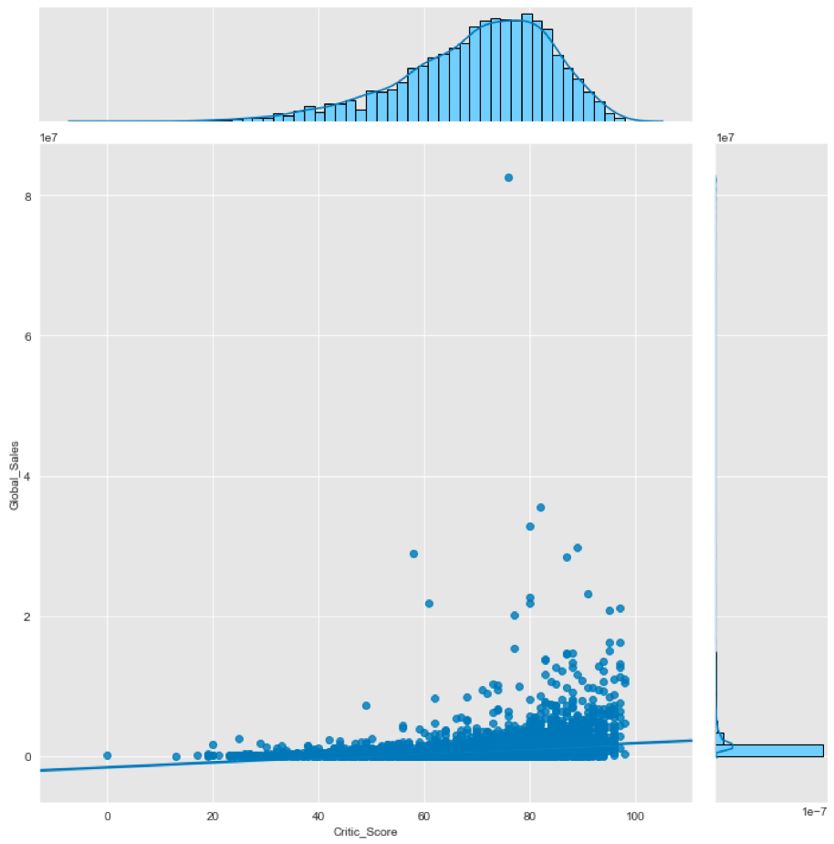
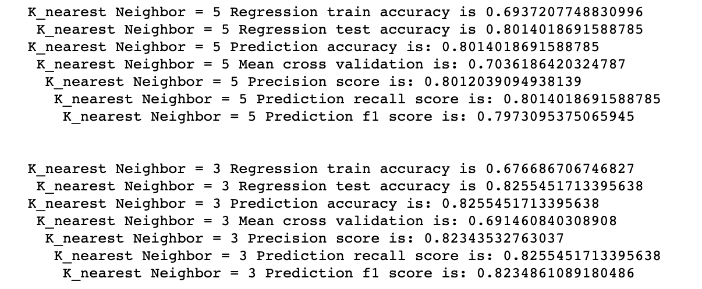
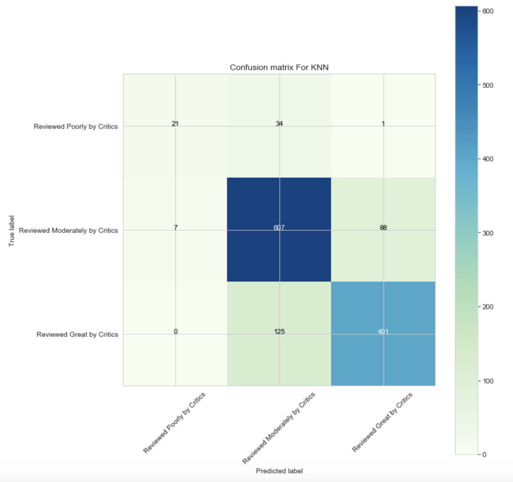

# Video Game MetaCritic Score Predictor

Video Game Critic Score Predicting models and Bonus models for Global Sales

Flatiron-Project-4-Video Game Critic Score

For my fourth project in Flatiron I wanted to see if I can make a machine learning model to predict a game's Metacritic score based on the data I selected. Found data on a little more than 6500 games; with data on sales records, year released, Metacritic score, genre and which platform it came out on. I had to also merge all same titles into one common row and combine all the platforms that released said game. After this my total data set went down to about 4300 data points.

## What Did I Do?

* Imported .cvs file, and api called for missing data

* Cleaned .csv file and grouped games sold on different platform together .

* Created Dummies variables for non-numerical data (for columns : Genre, Metacritic Score, Rating, etc.) so we can work with these data.

* Visualized all data against each other to see if we can find any solid correlations

* Found some correlations between categories.

* Split the Critic score into 3 groups; for classification:
- 1 if score is equal to OR less then 40
- 2 if score is in between 51 and 74
- 3 if score is equal to OR more then 75

* Split the Global  sales into 3 groups; for classification:
- 1 if sold equal to OR less then 1.50 million
- 2 if sold in between 1.51 million and 7.49 million
- 3 if score is equal to OR more then 7.5 million

* I then applied a few training models (Logistic, K-Nearest Neighbors, RandomForest, and Support Vector Classification just to name a few)

* After testing i ran some precision test(f1_score, precision_score, accuracy_score, etc.) and then I made a confusion matrix for each model to show the relationship between the 3 classifications and the probability of the outcome.

* Finally I showed all results of the tested models in a neat table.

I was looking for either precision or F1 Score for the determining outcome; F1 Score would be a better measure to use if we need to seek a balance between Precision and Recall AND there is an uneven class distribution (large number of Actual Negatives).

The results showed KNN (K-Nearest Neighbors = 3) actually preformed the best across the board, through out all tests(except accuracy_score through cross validation).

## Built With

* Python3.8
* Jupyter Notebook 6.0.0
* A few imports: pandas, numpy, matplotlib.pyplot, seaborn, statsmodels and sklearn

## Authors

* **Samuel Diaz** - *Creator* - [sdman135](https://github.com/sdman135/)
